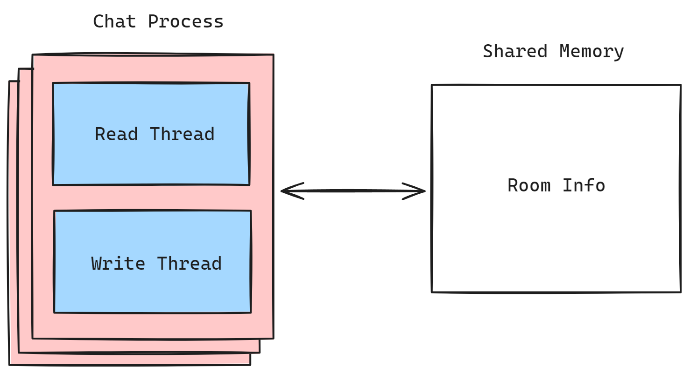
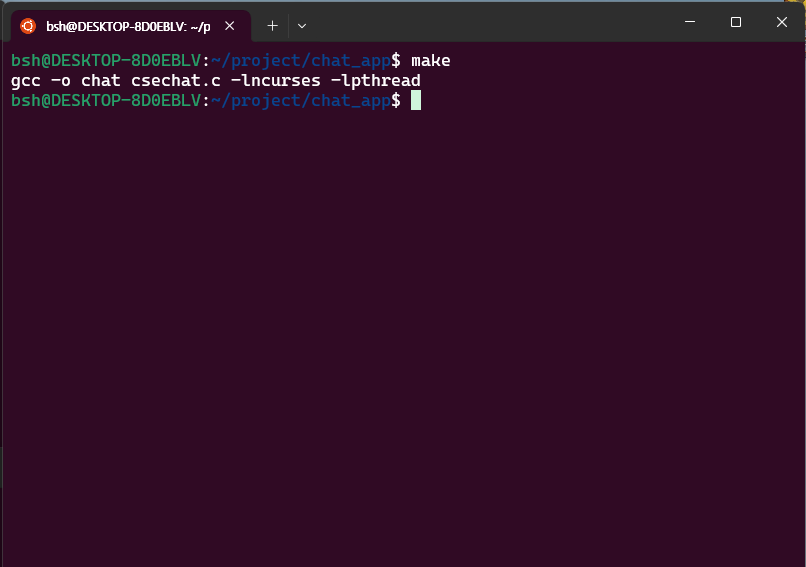
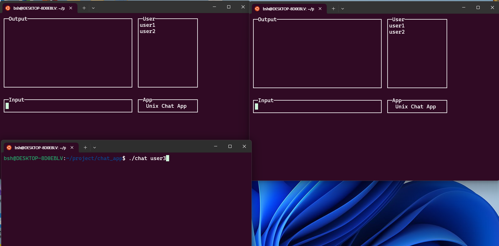
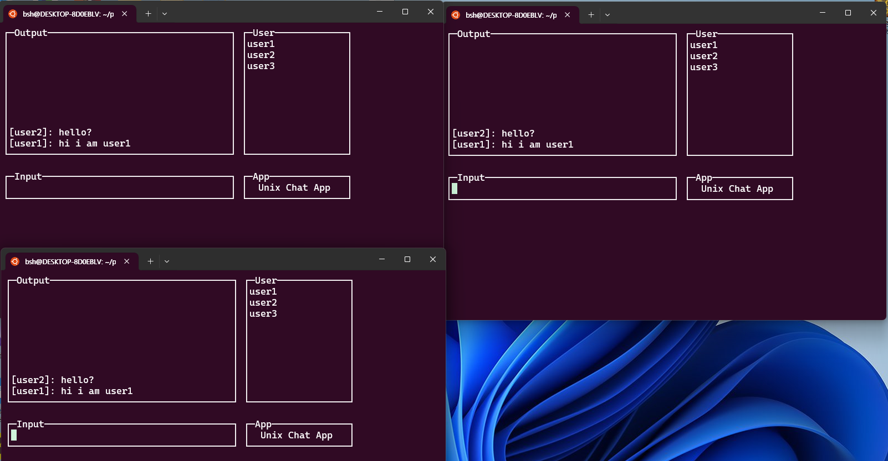
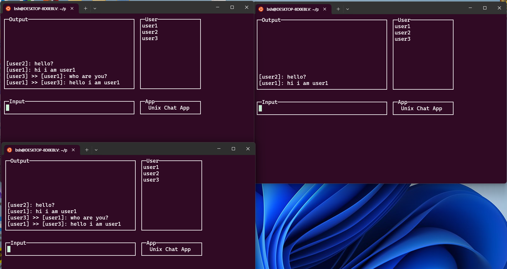
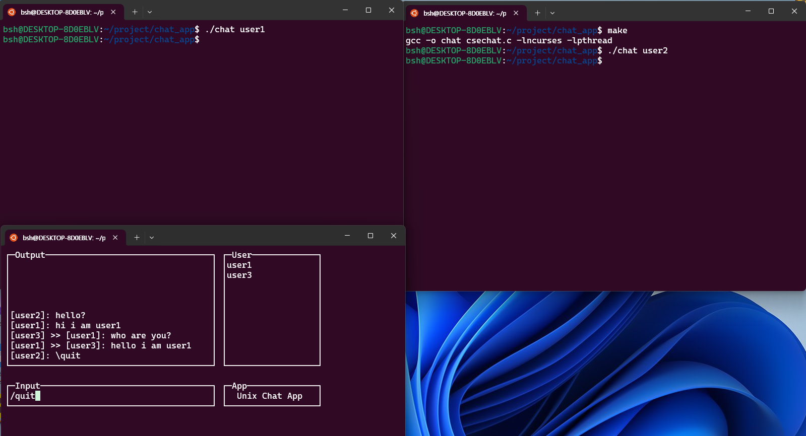
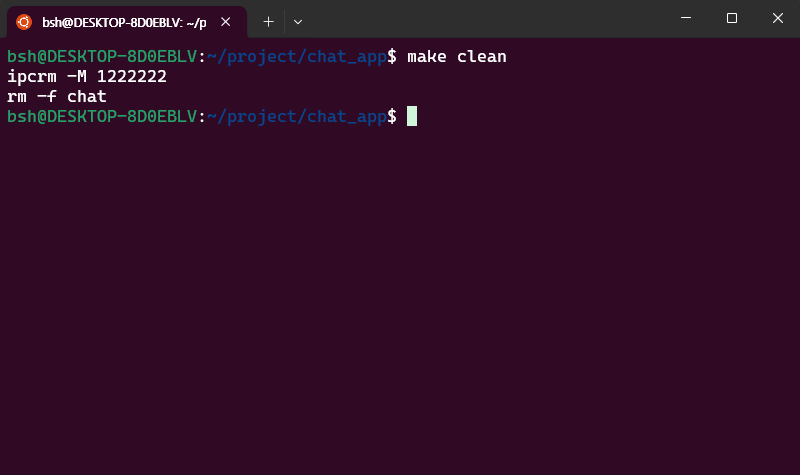

# 유닉스 응용 프로그래밍
[Github Link](https://github.com/sihyeong671/Unix-advanced-programming/tree/feat/chat_v6)

## 팀 구성
- [박시형](https://github.com/sihyeong671?tab=repositories)
- [장인성](https://github.com/is-jang)


## Env
- **OS** : Windows 11. WSL2. Ubuntu 22.04 LTS

## How To use

### Install library
```sh
sudo apt-get update
sudo apt-get install libncurses5-dev
sudo apt-get install libncursesw5-dev
sudo apt-get install build-essential
```
### Run
```sh
# 파일 컴파일
make
# open 3 terminal
./chat <userID>
# 실행 파일 삭제, 공유메모리 삭제
make clean
```

## Simple Architecture
<p align=center>
    
</p>

## Process Screen Shot
<p align=center>
    <b>1. make 명령어를 사용해 컴파일 실행</b>
    <br>
    
    <br>
    <b>2. ./chat {userID} 커맨드를 사용해 채팅방 입장</b>
    <br>
    
    <br>
    <b>3. 채팅을 치면 전체 유저에게 본인이 친 채팅이 출력</b>
    <br>
    
    <br>
    <b>4. /stalk {userID} {msg} 커맨드로 특정 유저에게만 보이는 귓속말 전달</b>
    <br>
    
    <br>
    <b>5. /quit or ctrl+c 커맨드를 통해 채팅방에서 퇴장</b>
    <br>
    
    <br>
    <b>6. make cleam 명령어로 실행파일 삭제</b>
    <br>
    
</p>

## Code

```c
// 헤더 파일 지정
// 변수 선언
...

void client_handler(int sig)
{
    quit = true;
    logout();
    pthread_join(tidRead, NULL);
    pthread_join(tidWrite, NULL);
    delwin(OutputWnd);
    delwin(InputWnd);
    delwin(UserWnd);
    delwin(AppWnd);
    endwin();
    pthread_mutex_destroy(&mutex);
    sem_unlink("/sem_key");
    wait(0);
    exit(0);
}

void server_handler(int sig)
{
    return;
}

// 윈도우 초기화 작업 함수
void initWindow()
{
    initscr();
    // ctrl 키 인식 위한 코드
    keypad(stdscr, true);
    // interupt가 들어오면 처리할 방법을 설정
    signal(SIGINT, client_handler);

    ...
    // 기존 과제 코드와 동일
}

void setShmAddr(int key, int size, void **shmAddr)
{
    shmId = shmget((key_t)key, size, 0666 | IPC_CREAT | IPC_EXCL);

    if (shmId < 0) // 이미 방이 만들어진 경우
    {
        shmId = shmget((key_t)key, size, 0666);
        *shmAddr = shmat(shmId, (void *)0, 0666);
        if (*shmAddr < 0)
        {
            perror("shmat attach is failed : ");
            exit(0);
        }

        sem = sem_open("/sem_key", 0, 0644); // 이미 생성된 세마포어 열기
        if (sem == SEM_FAILED)
        {
            perror("sem_open: ");
            exit(0);
        }

        login();
    }
    else // 새로 방을 만드는 경우
    {
        *shmAddr = shmat(shmId, (void *)0, 0666);
        if (*shmAddr < 0)
        {
            perror("shmat attach is failed : ");
            exit(0);
        }

        sem_unlink("/sem_key");
        sem = sem_open("/sem_key", O_CREAT | O_EXCL, 0644, 1); // 세마포어 생성 후 열기 (초기값 1)
        if (sem == SEM_FAILED)
        {
            perror("sem_open: ");
            exit(-1);
        }

        login();

        pid_t pid = fork(); // 포크를 통해 계속 인원이 0인지 검사
        if (pid == 0)
        {
            signal(SIGINT, server_handler);
            while (true)
            {
                sem_wait(sem);
                if (((ROOM_INFO *)roomShmAddr)->userCnt == 0)
                {
                    sem_post(sem);
                    break;
                }
                sem_post(sem);
                sleep(0);
            }

            sem_unlink("/sem_key"); // 세마포어 제거
            shmctl(shmId, IPC_RMID, 0); // 공유메모리 제거
            exit(0);
        }
    }
}

```
### Named semaphore가 사용된 코드 및 사용된 이유
사용자들이 채팅을 칠 때 쓰기작업을 하게 되는데 이때 동시에 쓰기작업을 하게 되면 기존 내용을 덮어쓰거나 원하지 않는 동작이 생기기 때문에 named semaphore를 사용해 공유 메모리에 쓰는 접근에 대해서 한 명씩만 하도록 하기 위해 사용했습니다.
```c
sem = sem_open("/sem_key", O_CREAT | O_EXCL, 0644, 1);

sem_wait(sem);
// do something ...
sem_post(sem);
```

### Ctrl+C 입력시 접속자 수 감소, 0일때 프로그램 종료 코드 및 사용된 이유
기존의 `mvwgetstr`메서드를 사용하면 ctrl을 입력으로 받아들이기 때문에 강제 종료를 허용하기 위해 `mvgetch`메서드로 입력을 받고 프로그램을 강제종료 시킬 수 있도록 합니다. 접속자 수가 0일 때는 공유메모리를 아무도 사용하는 중이 아니기 때문에 제거해줍니다.

```c
void client_handler(int sig) // ctrl+c 를 입력할 때 종료하는 로직
{
    quit = true;
    logout();
    pthread_join(tidRead, NULL);
    pthread_join(tidWrite, NULL);
    delwin(OutputWnd);
    delwin(InputWnd);
    delwin(UserWnd);
    delwin(AppWnd);
    endwin();
    pthread_mutex_destroy(&mutex);
    sem_unlink("/sem_key");
    wait(0);
    exit(0);
}

void initWindow(){
    ...
    // ctrl 키 인식 위해 사용
    keypad(stdscr, true);
    signal(SIGINT, client_handler);
    ...
}
void chatWrite(){
    ...
    // 입력 로직
    while ((ch = mvwgetch(InputWnd, 1, i + 1)) != ERR)
        {
            if (ch == '\n' || ch == '\r')
            {
                break;
            }
            else if (i < sizeof(inputStr) - 1)
            {
                inputStr[i++] = ch;
            }
        }
        inputStr[i] = '\0';
    ...
}

void setShmAddr(int key, int size, void **shmAddr)
{
    ...
    // 방을 새로 만들었을 경우 실행 되는 코드
    // fork를 통해 자식프로세스가 계속 0인지 검사하고 0이 되면 chmctl을 통해 공유메모리를 자동으로 제거시키고 프로레스가 종료
    pid_t pid = fork();
    if (pid == 0)
    {
        signal(SIGINT, server_handler);
        while (true)
        {
            if (((ROOM_INFO *)roomShmAddr)->userCnt == 0)
            {
                break;
            }
            sleep(0);
        }

        sem_unlink("/sem_key");
        shmctl(shmId, IPC_RMID, 0);
        exit(0);
    }
    ...
}

```

## 참고 사항
공유 메모리는 malloc과 같기 때문에 할당하고 나서 해제를 해주어야 합니다.

```sh
ipcs # 공유 메모리 세그먼트 확인
ipcrm -m $(shmid) # 공유메모리 삭제
```

```sh
kill -9 $(pid) # 프로세스 kill
```