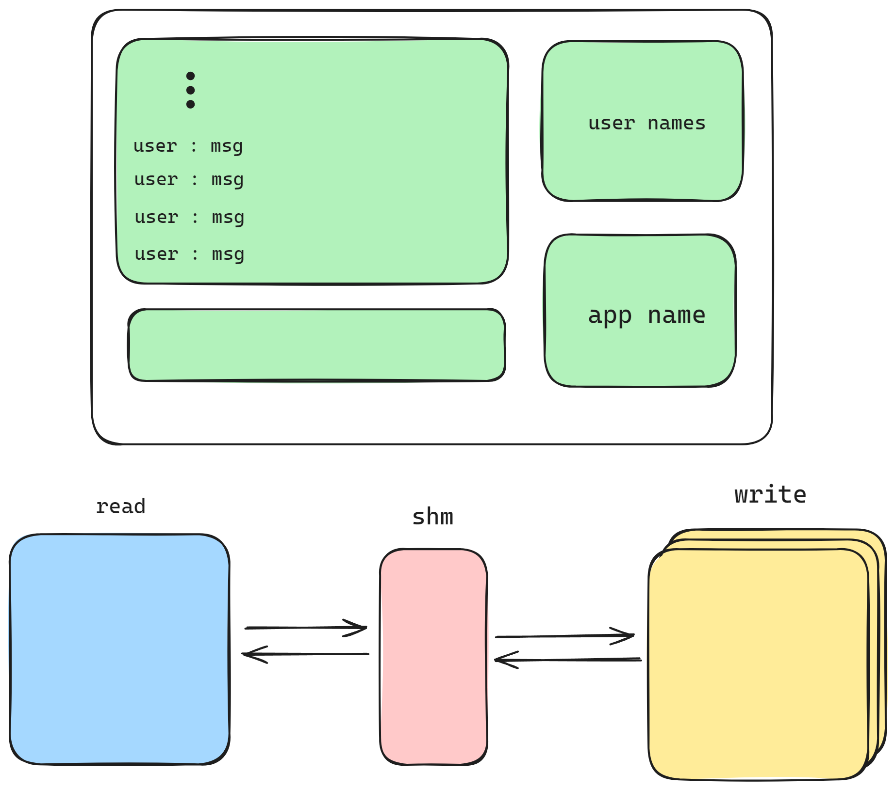
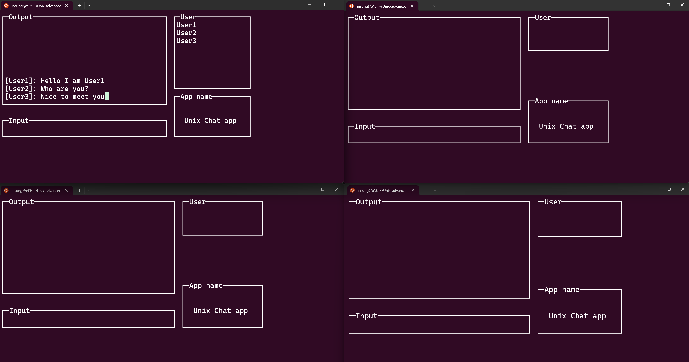

# 유닉스 응용 프로그래밍

## 팀 구성
- [박시형](https://github.com/sihyeong671?tab=repositories)
- [장인성](https://github.com/is-jang)

## TODO
- [ ] 동일 함수를 따로 C 파일로 만들어 라이브러리로 구현
- [ ] 코드 최적화
- [ ] ChatInfo 링크드리스트로 구현
- [ ] 스크롤 구현

## Env
- **OS** : Windows 11. WSL2. Ubuntu 22.04 LTS

## How To use

### Install library
```sh
sudo apt-get update
sudo apt-get install libncurses5-dev
sudo apt-get install libncursesw5-dev
sudo apt-get install build-essential
```
### Run
```sh
# 파일 컴파일
make

# open 4 terminal and run 1 read process, 3 write process
./read
./write

# 실행 파일 삭제, 공유메모리 삭제
make clean
```

## Simple Architecture & Screen Shot
<p align="center">
    
</p>

<p align="center">
    
</p>


## 참고 사항
공유 메모리는 malloc과 같기 때문에 할당하고 나서 해제를 해주어야 합니다.

ipcs 명령어를 통해 해제할 수 있습니다.
```sh
ipcs # 공유 메모리 세그먼트 확인
ipcrm -m $(shmid) # 공유메모리 삭제
```

```sh
kill -9 $(pid) # 프로세스 kill
```