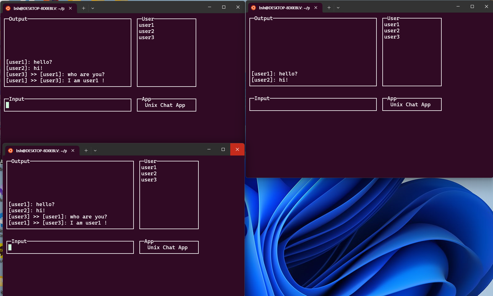

# 유닉스 응용 프로그래밍
[Github Link](https://github.com/sihyeong671/Unix-advanced-programming/tree/feat/chat_v2)

## 팀 구성
- [박시형](https://github.com/sihyeong671?tab=repositories)
- [장인성](https://github.com/is-jang)


## Env
- **OS** : Windows 11. WSL2. Ubuntu 22.04 LTS

## How To use

### Install library
```sh
sudo apt-get update
sudo apt-get install libncurses5-dev
sudo apt-get install libncursesw5-dev
sudo apt-get install build-essential
```
### Run
```sh
# 파일 컴파일
make
# open 3 terminal
./chat <userID>
# 실행 파일 삭제, 공유메모리 삭제
make clean
```

## Simple Architecture & Screen Shot
<p align=center>
    
</p>
<p align=center>
    
</p>

## Code
**csechat.h**
```c
#ifndef __CHAT_INFO_H__
#define __CHAT_INFO_H__

// 채팅 최대 저장 용량
#define MAX_CAPACITY 100

// 메시지 구조체
typedef struct chatInfo
{
    char senderID[20];
    char receiverID[20];
    char message[40];
} CHAT_INFO;

// 채팅방 구조체
typedef struct roomInfo
{
    int chatFlag;
    int userCnt;
    char userIDs[3][20];
    CHAT_INFO chats[MAX_CAPACITY];
} ROOM_INFO;

#endif
```
**csechat.c**
```c
// 라이브러리 불러오기
#include <stdio.h>
#include <stdlib.h>
#include <pthread.h>
#include <unistd.h>
#include <ctype.h>
#include <string.h>
#include <unistd.h>
#include <stdlib.h>
#include <fcntl.h>
#include <sys/shm.h>
#include <ncurses.h>

#include "chat_info.h"

#define MAX_LEN 100

int getKey(char *file_path);
void initWindow();
void setShmAddr(int key, int size, void **shmAddr);
void chatRead();
void chatWrite();

// 필요한 전역 변수 정의
WINDOW *OutputWnd, *InputWnd, *UserWnd, *AppWnd;

bool quit;
int chatShmId, roomShmId;
int shmbufindex, readmsgcount;
CHAT_INFO *chatInfo = NULL;
void *roomShmAddr = (void *)0;
int roomKey;
char userID[20];
pthread_mutex_t mutex = PTHREAD_MUTEX_INITIALIZER;

char inputStr[40];
char allMsg[40];
char whisperMsg[40];
char receiverID[20];
char *pch;
```

```c
// 프로세스 시작시 윈도우 생성하는 함수
void initWindow()
{
    initscr();

    OutputWnd = subwin(stdscr, 12, 42, 0, 0);
    InputWnd = subwin(stdscr, 3, 42, 13, 0);
    UserWnd = subwin(stdscr, 12, 20, 0, 43);
    AppWnd = subwin(stdscr, 3, 20, 13, 43);

    wtimeout(InputWnd, 3000);

    box(OutputWnd, 0, 0);
    box(InputWnd, 0, 0);
    box(UserWnd, 0, 0);
    box(AppWnd, 0, 0);

    mvwprintw(OutputWnd, 0, 2, "Output");
    mvwprintw(InputWnd, 0, 2, "Input");
    mvwprintw(UserWnd, 0, 2, "User");
    mvwprintw(AppWnd, 0, 2, "App");
    mvwprintw(AppWnd, 1, 3, "Unix Chat App");
    refresh();
}
```

```c
// 공유메모리 키 불러오는 함수
int getKey(char *file_path)
{
    FILE *fs;
    fs = fopen(file_path, "r");
    char str[MAX_LEN];
    fgets(str, MAX_LEN, fs);
    int num = atoi(str);
    return num;
}
```

```c
// 공유 메모리에 접근하여 주소값을 설정하는 함수
void setShmAddr(int key, int size, void **shmAddr)
{
    int shmId = shmget((key_t)key, size, 0666 | IPC_CREAT | IPC_EXCL);

    if (shmId < 0) // 이미 존재하는 경우
    {
        shmId = shmget((key_t)key, size, 0666);
        *shmAddr = shmat(shmId, (void *)0, 0666);
        if (*shmAddr < 0)
        {
            perror("shmat attach is failed : ");
            exit(0);
        }
    }
    else 
    {
        *shmAddr = shmat(shmId, (void *)0, 0666);
    }
}

```

```c
// 유저가 프로세스 시작(채팅 앱 입장)시 ROOM_INFO의 현재 유저 수를 늘리고, 유저 이름을 저장하는 함수
void login()
{
    int currentUserCnt = ((ROOM_INFO *)roomShmAddr)->userCnt;
    if (currentUserCnt < 3)
    {
        memcpy(((ROOM_INFO *)roomShmAddr)->userIDs[currentUserCnt], userID, sizeof(userID));
        ((ROOM_INFO *)roomShmAddr)->userCnt++;
    }
    else
    {
        perror("too much users in room");
        exit(0);
    }
}
```
```c
// 프로세스 종료(채팅 앱 퇴장)시 
void logout()
{
    int index = 0;
    // 현재 사용자의 인덱스를 구한다
    for (int i = 0; i < 3; i++)
    {
        if (!strcmp(((ROOM_INFO *)roomShmAddr)->userIDs[i], userID))
        {
            index = i;
        }
    }
    // 사용자를 제거하고 남은 사용자들의 인덱스를 앞으로 옮긴다
    for (int i = index; i < 3; i++)
    {
        memcpy(((ROOM_INFO *)roomShmAddr)->userIDs + i, ((ROOM_INFO *)roomShmAddr)->userIDs + (i + 1), 20 * sizeof(char));
    }
    ((ROOM_INFO *)roomShmAddr)->userCnt--;
}
```
```c
// 공유메모리에 존재하는 채팅 내용 읽는 함수
void chatRead()
{
    while (!quit)
    {
        pthread_mutex_lock(&mutex);
        // 읽기와 쓰기시 쓰레기 값이 출력되는 문제 때문에 mutext lock을 한다(추후 세마포어를 사용하여 프로세스간 충돌도 해결하도록 수정이 필요)

        wclear(OutputWnd);
        box(OutputWnd, 0, 0);
        mvwprintw(OutputWnd, 0, 2, "Output");

        
        int line = 10; // 최대 10개의 메시지만 출력
        for (int i = MAX_CAPACITY - 1; i >= 0; i--) // 모든 for문을 검사
        {
            bool msgEmpty = !(strcmp(((ROOM_INFO *)roomShmAddr)->chats[i].message, ""));
            if (!msgEmpty)
            {
                bool isAllMsg = !strcmp(((ROOM_INFO *)roomShmAddr)->chats[i].receiverID, "ALL");
                bool sendWhisper = !strcmp(((ROOM_INFO *)roomShmAddr)->chats[i].senderID, userID);
                bool receiveWhisper = !strcmp(((ROOM_INFO *)roomShmAddr)->chats[i].receiverID, userID);
                if (isAllMsg)
                {
                    mvwprintw(
                        OutputWnd,
                        line--,
                        1,
                        "[%s]: %s",
                        ((ROOM_INFO *)roomShmAddr)->chats[i].senderID,
                        ((ROOM_INFO *)roomShmAddr)->chats[i].message);
                }
                else if (sendWhisper || receiveWhisper)
                {
                    mvwprintw(
                        OutputWnd,
                        line--,
                        1,
                        "[%s] >> [%s]: %s",
                        ((ROOM_INFO *)roomShmAddr)->chats[i].senderID,
                        ((ROOM_INFO *)roomShmAddr)->chats[i].receiverID,
                        ((ROOM_INFO *)roomShmAddr)->chats[i].message);
                }
            }
            if (line == 0) // 10개 모두 출력시 for문 탈출
            {
                break;
            }
        }
        wrefresh(OutputWnd);

        wclear(UserWnd);
        box(UserWnd, 0, 0);
        mvwprintw(UserWnd, 0, 2, "User");

        // 유저 창에 본인 ID 출력
        for (int i = 0; i < ((ROOM_INFO *)roomShmAddr)->userCnt; i++)
        {
            if ((strcmp(((ROOM_INFO *)roomShmAddr)->userIDs[i], "")))
            {
                mvwprintw(
                    UserWnd,
                    i + 1,
                    1,
                    "%s",
                    ((ROOM_INFO *)roomShmAddr)->userIDs[i]);
            }
        }
        wrefresh(UserWnd);
        pthread_mutex_unlock(&mutex); // mutex unlock
        sleep(0); // 우선 순위를 다른 쓰레드로 넘기기위한 sleep(0) 사용
    }
}
```
```c
// 공유메모리에 채팅 내용 쓰는 함수
void chatWrite()
{
    while (1)
    {
        pthread_mutex_lock(&mutex);
        mvwgetstr(InputWnd, 1, 1, inputStr); // 유저 입력

         // 입력이 비었는지 검사
        bool isEmptyMsg = !strcmp(inputStr, "");
        if (isEmptyMsg)
        {
            pthread_mutex_unlock(&mutex);
            sleep(0);
            continue;
        }

        // 탈출명령어인지 검사
        bool isQuitMsg = !strcmp(inputStr, "/quit");
        if (isQuitMsg) 
        {
            logout();
            pthread_mutex_unlock(&mutex);
            quit = true;
            break;
        }

        strcpy(allMsg, inputStr);

        // strtok은 동작 과정 중 inputStr의 space를 '\0'으로 변경시킴(귓속말이 아닐 때 그대로 inputStr을 출력할 경우 공백 이후의 문자가 출력되지 않음)
        pch = strtok(inputStr, " ");
        // 귓속말인 경우 진입점
        bool isWhisper = !strcmp(pch, "/stalk");
        if (isWhisper)
        {
            // /stalk이후 첫번째 문자 검사 
            pch = strtok(NULL, " ");
            if (pch != NULL)
            {
                strcpy(receiverID, pch); // 첫번째 문자열 존재하는 경우(NULL이 아닌 경우) receiverID에 pch 복사
            }
            else
            {
                // 명령어가 제대로 입력되지 않는 경우 입력 지움
                wclear(InputWnd);
                box(InputWnd, 0, 0);
                mvwprintw(InputWnd, 0, 2, "Input");
                wrefresh(InputWnd);

                pthread_mutex_unlock(&mutex);
                sleep(0);
                continue;
            }
            pch = strtok(NULL, " ");
            if (pch != NULL)
            {
                strcpy(whisperMsg, pch); // 두번째 문자열 존재하는 경우 whisperMsg에 copy
            }
            else
            {
                wclear(InputWnd);
                box(InputWnd, 0, 0);
                mvwprintw(InputWnd, 0, 2, "Input");
                wrefresh(InputWnd);

                pthread_mutex_unlock(&mutex);
                sleep(0);
                continue;
            }
            pch = strtok(NULL, " ");
            while (pch != NULL) // ID 이후는 모두 whisperMsg이므로 while loop를 통해 모든 메시지를 whisperMsg에 담는다
            {
                strcat(whisperMsg, " ");
                strcat(whisperMsg, pch);
                pch = strtok(NULL, " ");
            }
            // 최신 메시지를 가장 마지막 array에 담기위해 메시지를 앞으로 한 인덱스 옮긴다.
            for (int i = 0; i < MAX_CAPACITY - 1; i++)
            {
                memcpy(((ROOM_INFO *)roomShmAddr)->chats + i, ((ROOM_INFO *)roomShmAddr)->chats + (i + 1), sizeof(CHAT_INFO));
            }
            // 마지막 인덱스에 receiverID, whisperMsg를 담는다.
            strcpy(((ROOM_INFO *)roomShmAddr)->chats[MAX_CAPACITY - 1].receiverID, receiverID);
            strcpy(((ROOM_INFO *)roomShmAddr)->chats[MAX_CAPACITY - 1].message, whisperMsg);
        }
        else // 귓속말이 아닌 경우 이전 메시지는 인덱스를 한칸씩 앞으로 옮기고 inputStr을 마지막 인덱스에 담는다.
        {
            for (int i = 0; i < MAX_CAPACITY - 1; i++)
            {
                memcpy(((ROOM_INFO *)roomShmAddr)->chats + i, ((ROOM_INFO *)roomShmAddr)->chats + (i + 1), sizeof(CHAT_INFO));
            }
            strcpy(((ROOM_INFO *)roomShmAddr)->chats[MAX_CAPACITY - 1].receiverID, "ALL");
            strcpy(((ROOM_INFO *)roomShmAddr)->chats[MAX_CAPACITY - 1].message, allMsg);
        }
        strcpy(((ROOM_INFO *)roomShmAddr)->chats[MAX_CAPACITY - 1].senderID, userID);

        wclear(InputWnd);
        box(InputWnd, 0, 0);
        mvwprintw(InputWnd, 0, 2, "Input");
        wrefresh(InputWnd);

        pthread_mutex_unlock(&mutex);
        sleep(0);
    }
}
```
```c

int main(int argc, char *argv[])
{
    if (argc < 2)
    {
        fprintf(stderr, "[Usage]: ./csechat userID\n");
        exit(0);
    }
    strcpy(userID, argv[1]);

    initWindow();
    roomKey = getKey("room_key.txt");
    setShmAddr(roomKey, sizeof(ROOM_INFO), &roomShmAddr);
    login();

    pthread_mutex_init(&mutex, NULL);
    pthread_t tidRead, tidWrite;
    int readErr = pthread_create(&tidRead, NULL, (void *)chatRead, NULL);
    int writeErr = pthread_create(&tidWrite, NULL, (void *)chatWrite, NULL);

    // join을 이용해 메인 쓰레드가 먼저 종료되지 않도록 보장
    pthread_join(tidRead, NULL);
    pthread_join(tidWrite, NULL);

    delwin(OutputWnd);
    delwin(InputWnd);
    delwin(UserWnd);
    delwin(AppWnd);
    endwin();
    // mutex 해제
    pthread_mutex_destroy(&mutex);
    return 0;
}
```

## 참고 사항
공유 메모리는 malloc과 같기 때문에 할당하고 나서 해제를 해주어야 합니다.

```sh
ipcs # 공유 메모리 세그먼트 확인
ipcrm -m $(shmid) # 공유메모리 삭제
```

```sh
kill -9 $(pid) # 프로세스 kill
```